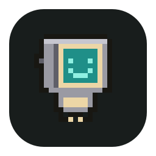
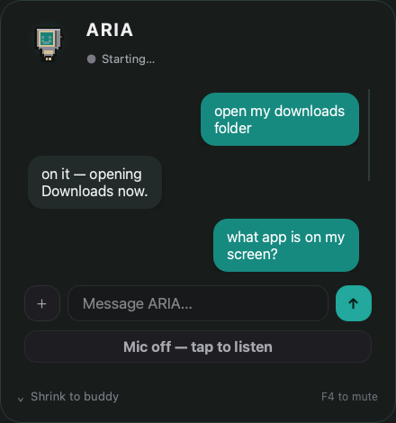

<div align="center">



# ARIA

**A real-time, voice-first AI buddy that lives in your menu bar — it hears, sees, remembers, and controls your computer.**

Powered by Gemini Live · runs locally · cross-platform · zero subscriptions

[](https://www.python.org/)
[](#-requirements)
[](https://pypi.org/project/PyQt6/)
[](https://creativecommons.org/licenses/by-nc/4.0/)



</div>

---

## What is ARIA?

ARIA is a personal AI assistant that sits in your **macOS menu bar** as a little cyan pixel-robot buddy. Click it (or just say **"Hey Aria"**) and it pops out, ready to talk. Through natural conversation it can open apps, manage files, read your screen and webcam, search the web, draft emails, build projects, and carry out multi-step goals on its own — speaking back to you in real time.

It runs on your machine against your own free Gemini key. No cloud account, no subscription, no telemetry.

---

## ✨ Highlights

| | |
|---|---|
| 🤖 **Desktop buddy** | A pixel-robot that lives in the menu bar. Click to summon, click to tuck away — hover and click animations included. |
| 🎙️ **Real-time voice** | Ultra-low-latency spoken conversation via Gemini Live, in any language. |
| 🗣️ **"Hey Aria" wake word** | Fully local wake-word + double-clap detection (Vosk) — no audio leaves your machine to listen. |
| 👁️ **Sees your world** | Reads your screen and webcam on demand. On-device object & face detection (YOLOv8 + DeepFace). |
| 🧠 **Persistent memory** | Remembers your projects, preferences, contacts, and people across sessions. |
| 🛠️ **Controls your computer** | Launch apps, manage files, run commands, control the browser, adjust system settings. |
| 🧩 **Autonomous mode** | Give it a goal; it decides one action at a time, sees the real result, and keeps going until it's done. |
| 📂 **File-aware** | Drag in PDFs, code, or images to summarize, analyze, or edit instantly. |
| ⌨️ **Type or talk** | Seamlessly switch between the chat box and your voice. |
| 🖥️ **Cross-platform** | macOS, Windows, and Linux, with OS auto-detection. |

---

## 🚀 Quick start

```bash
# 1. Clone
git clone https://github.com/ArnavParashar49/ARIA.git
cd ARIA

# 2. Create a virtual environment (keep the project OUT of ~/Downloads on macOS — see Troubleshooting)
python3 -m venv .venv
source .venv/bin/activate          # Windows: .venv\Scripts\activate

# 3. Install
pip install -r requirements.txt
playwright install                  # browser automation engine

# 4. Add your free Gemini API key
cp config/api_keys.example.json config/api_keys.json
#   then edit config/api_keys.json and paste your key from https://aistudio.google.com

# 5. Run
python main.py
```

On first launch ARIA downloads a small (~40 MB) local speech model for the wake word, and the vision weights (`yolov8n.pt`) if they're missing. Grant **microphone** (and **camera** / **accessibility**) permission when macOS asks.

> Then just say **"Hey Aria"**, clap twice, or click the menu-bar robot. **Double-click** the buddy to open the full chat window.

---

## 🍎 Run it as a real menu-bar app (macOS)

Don't want a terminal window hanging around? Bundle ARIA into a proper `.app` that lives only in the menu bar (no Dock icon) and starts at login:

```bash
./scripts/build_macos_app.sh --login   # builds ARIA.app + registers it as a Login Item
open ./ARIA.app
```

The bundle is a thin wrapper around your local `.venv`, so it always runs the live code — no need to rebuild after pulling changes (only re-run it if you change the icon or `Info.plist`).

---

## ⚙️ Configuration

Everything lives in `config/api_keys.json` (gitignored — your key never leaves your machine):

| Key | Default | What it does |
|---|---|---|
| `gemini_api_key` | — | Your free key from [aistudio.google.com](https://aistudio.google.com) |
| `os_system` | `auto` | OS detection — leave on `auto` |
| `autonomous_mode` | `true` | Let ARIA plan & execute multi-step goals on its own ([details](AUTONOMOUS.md)) |
| `local_vision` / `yolo_enabled` | `true` | On-device screen/webcam object detection (YOLOv8) |
| `face_recognition_enabled` | `true` | Recognize people you've introduced ([privacy](VISION_PRIVACY.md)) |
| `siri_bar` | `top-right` | Where the buddy docks (corner + margins) |
| `noise_gate` | `true` | Suppress background noise on the mic |
| `prefer_gemini_lite` | `true` | Use the faster/cheaper model where it suffices |

---

## 🧠 How it works

```
You ── voice / text ──► ARIA (Gemini Live, core/llm.py)
                          │
                          ▼
              Hybrid orchestrator (hybrid/) ── routes intent
                          │
        ┌─────────────────┼─────────────────────┐
        ▼                 ▼                       ▼
   Tool actions     Autonomous loop          Vision / memory
   (actions/)       (core/agent_loop.py)     (on-device)
   open apps,       plan → act → observe     YOLO + DeepFace,
   files, browser,  → repeat until done      persistent context
   email, web…
```

- **`core/`** — the Gemini Live client, the autonomous tool-use loop, prompt, and platform helpers.
- **`hybrid/`** — the orchestrator/router that decides whether a request is a quick tool call or a full autonomous task.
- **`actions/`** — 35+ capability modules: file control, browser control, screen/vision, email & messaging, web search, project building, and more.
- **`agent/`** — planner / executor / task-queue for structured multi-step jobs.
- **`ui_*.py`** — the PyQt6 interface: the pixel buddy (`ui_buddy.py`), menu-bar tray (`ui_tray.py`), Siri-style bar (`ui_siri_bar.py`), and chat window (`ui_panel.py`).
- **`wake_listener.py`** — local "Hey Aria" + double-clap detection (Vosk), nothing streamed to the cloud just to listen.

---

## 🔒 Privacy

- Your API key and personal memory (`config/api_keys.json`, `memory/`) are **gitignored** and stay local.
- Wake-word listening is **fully on-device** — audio is only sent to Gemini *after* you summon ARIA.
- Vision runs locally (YOLOv8 + DeepFace). See **[VISION_PRIVACY.md](VISION_PRIVACY.md)** for what's processed and stored.

---

## 📋 Requirements

| | |
|---|---|
| **OS** | macOS 12+, Windows 10/11, or Linux |
| **Python** | 3.11 or 3.12 |
| **Microphone** | Required for voice |
| **Webcam** | Optional, for vision features |
| **API key** | Free Gemini key ([aistudio.google.com](https://aistudio.google.com)) |

> Some OS-specific packages aren't bundled to keep `requirements.txt` light. If you hit a `ModuleNotFoundError`, install that one package for your platform with `pip install <module>`.

---

## 🩺 Troubleshooting

- **macOS: app won't start / `Operation not permitted` reading `.venv`** — the project is in a TCC-protected folder. **Keep ARIA out of `~/Downloads`, `~/Desktop`, and `~/Documents`** (use e.g. `~/ARIA`). Those folders block a launched `.app` from reading the virtualenv.
- **No microphone / "wake word disabled"** — grant Microphone permission in System Settings → Privacy, then relaunch. The first run also downloads the Vosk speech model.
- **"Hey Aria" not triggering** — speak it as one phrase; double-clap also works as a fallback.
- **`playwright` errors** — run `playwright install` once after `pip install`.

---

## ⚠️ License

Personal and non-commercial use only — **[Creative Commons BY-NC 4.0](https://creativecommons.org/licenses/by-nc/4.0/)**.

---

<div align="center">

Built by **AP** — your real-world personal AI assistant.

⭐ **Star the repo if ARIA helps you.**

</div>
